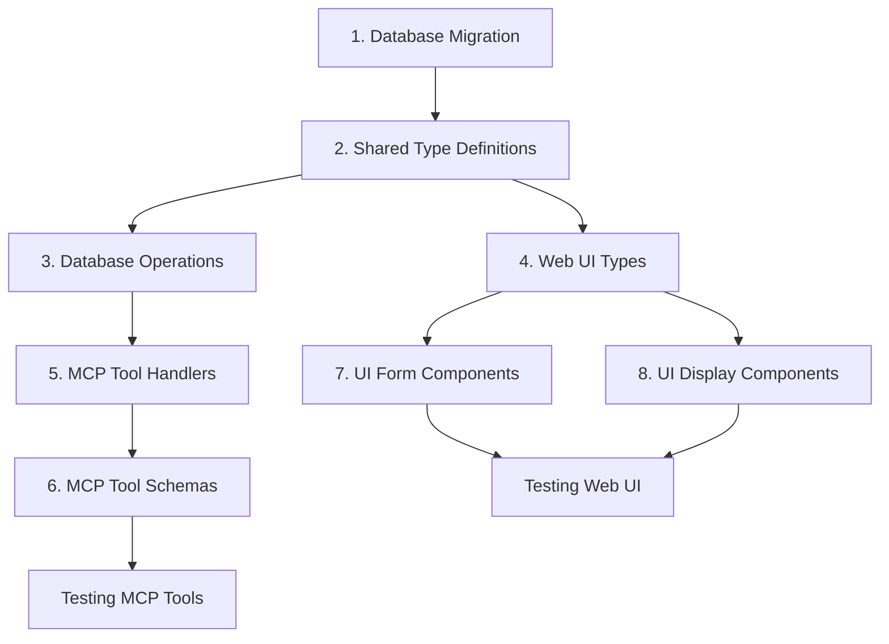
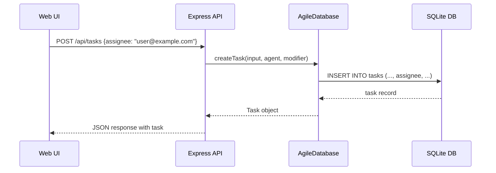
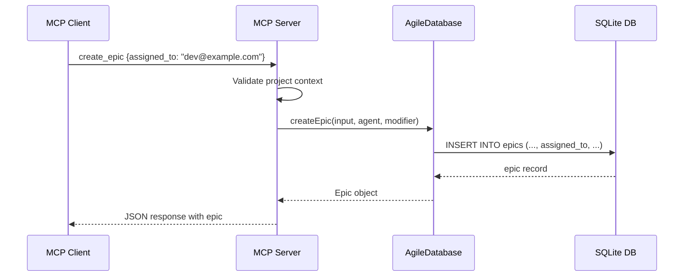
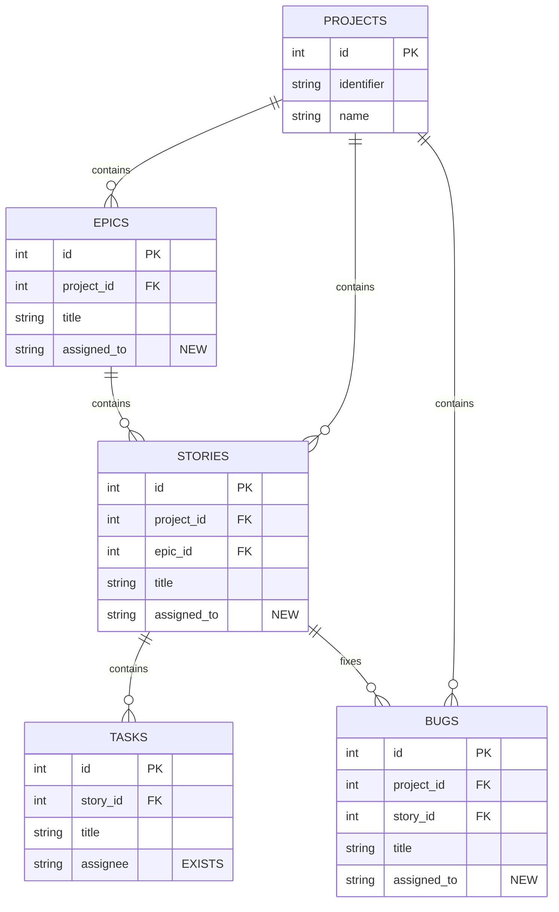

# Assigned To Field Implementation Analysis

**Date**: 2025-10-29
**Analyzed By**: code-deep-dive-analyst

## Executive Summary

This analysis documents the current state of the agile-mcp codebase regarding assignee/assigned_to fields across all agile objects (epics, stories, bugs, tasks). The system currently only has assignee support for Tasks, with no assignee fields for Epics, Stories, or Bugs. This report provides a complete gap analysis and implementation roadmap for adding "assigned_to" fields to all entities.

**Key Findings**:
- **Tasks**: Already have full assignee support (database, types, MCP tools, UI)
- **Epics, Stories, Bugs**: No assignee support at any layer
- **Consistent Pattern**: The codebase follows a clear pattern that makes implementation straightforward
- **Required Changes**: 4 main layers (database, types, MCP tools, UI) across 3 entities (epics, stories, bugs)

---

## Current Object Structure

### 1. Epics

**Database Schema** (`shared/src/database.ts:329-342`):
```sql
CREATE TABLE IF NOT EXISTS epics (
  id INTEGER PRIMARY KEY AUTOINCREMENT,
  project_id INTEGER NOT NULL,
  title TEXT NOT NULL,
  description TEXT NOT NULL,
  status TEXT NOT NULL DEFAULT 'todo',
  created_at TEXT NOT NULL DEFAULT (datetime('now')),
  updated_at TEXT NOT NULL DEFAULT (datetime('now')),
  agent_identifier TEXT,
  last_modified_by TEXT,
  FOREIGN KEY (project_id) REFERENCES projects (id) ON DELETE CASCADE
)
```

**TypeScript Interface** (`shared/src/types.ts:20-30`):
```typescript
export interface Epic {
  id: number;
  project_id: number;
  title: string;
  description: string;
  status: EntityStatus;
  created_at: string;
  updated_at: string;
  agent_identifier: string | null;
  last_modified_by: string | null;
}
```

**Missing**: `assigned_to` or `assignee` field

---

### 2. Stories

**Database Schema** (`shared/src/database.ts:346-363`):
```sql
CREATE TABLE IF NOT EXISTS stories (
  id INTEGER PRIMARY KEY AUTOINCREMENT,
  project_id INTEGER NOT NULL,
  epic_id INTEGER,
  title TEXT NOT NULL,
  description TEXT NOT NULL,
  acceptance_criteria TEXT,
  status TEXT NOT NULL DEFAULT 'todo',
  priority TEXT NOT NULL DEFAULT 'medium',
  points INTEGER,
  created_at TEXT NOT NULL DEFAULT (datetime('now')),
  updated_at TEXT NOT NULL DEFAULT (datetime('now')),
  agent_identifier TEXT,
  last_modified_by TEXT,
  FOREIGN KEY (project_id) REFERENCES projects (id) ON DELETE CASCADE,
  FOREIGN KEY (epic_id) REFERENCES epics (id) ON DELETE SET NULL
)
```

**TypeScript Interface** (`shared/src/types.ts:32-46`):
```typescript
export interface Story {
  id: number;
  project_id: number;
  epic_id: number | null;
  title: string;
  description: string;
  acceptance_criteria: string | null;
  status: EntityStatus;
  priority: Priority;
  points: number | null;
  created_at: string;
  updated_at: string;
  agent_identifier: string | null;
  last_modified_by: string | null;
}
```

**Missing**: `assigned_to` or `assignee` field

---

### 3. Bugs

**Database Schema** (`shared/src/database.ts:366-385`):
```sql
CREATE TABLE IF NOT EXISTS bugs (
  id INTEGER PRIMARY KEY AUTOINCREMENT,
  project_id INTEGER NOT NULL,
  story_id INTEGER,
  title TEXT NOT NULL,
  description TEXT NOT NULL,
  severity TEXT NOT NULL DEFAULT 'major',
  error_message TEXT,
  status TEXT NOT NULL DEFAULT 'todo',
  priority TEXT NOT NULL DEFAULT 'medium',
  points INTEGER,
  created_at TEXT NOT NULL DEFAULT (datetime('now')),
  updated_at TEXT NOT NULL DEFAULT (datetime('now')),
  agent_identifier TEXT,
  last_modified_by TEXT,
  FOREIGN KEY (project_id) REFERENCES projects (id) ON DELETE CASCADE,
  FOREIGN KEY (story_id) REFERENCES stories (id) ON DELETE SET NULL
)
```

**TypeScript Interface** (`shared/src/types.ts:61-76`):
```typescript
export interface Bug {
  id: number;
  project_id: number;
  story_id: number | null;
  title: string;
  description: string;
  severity: BugSeverity;
  error_message: string | null;
  status: EntityStatus;
  priority: Priority;
  points: number | null;
  created_at: string;
  updated_at: string;
  agent_identifier: string | null;
  last_modified_by: string | null;
}
```

**Missing**: `assigned_to` or `assignee` field

---

### 4. Tasks (REFERENCE - Already Has Assignee Support)

**Database Schema** (`shared/src/database.ts:389-402`):
```sql
CREATE TABLE IF NOT EXISTS tasks (
  id INTEGER PRIMARY KEY AUTOINCREMENT,
  story_id INTEGER NOT NULL,
  title TEXT NOT NULL,
  description TEXT NOT NULL,
  status TEXT NOT NULL DEFAULT 'todo',
  assignee TEXT,  -- ✅ ALREADY EXISTS
  created_at TEXT NOT NULL DEFAULT (datetime('now')),
  updated_at TEXT NOT NULL DEFAULT (datetime('now')),
  agent_identifier TEXT,
  last_modified_by TEXT,
  FOREIGN KEY (story_id) REFERENCES stories (id) ON DELETE CASCADE
)
```

**TypeScript Interface** (`shared/src/types.ts:48-59`):
```typescript
export interface Task {
  id: number;
  story_id: number;
  title: string;
  description: string;
  status: EntityStatus;
  assignee: string | null;  // ✅ ALREADY EXISTS
  created_at: string;
  updated_at: string;
  agent_identifier: string | null;
  last_modified_by: string | null;
}
```

**Web UI Interface** (`web-ui/src/types/index.ts:35-45`):
```typescript
export interface Task {
  id: number;
  story_id: number;
  title: string;
  description: string;
  status: EntityStatus;
  assignee?: string;  // ✅ ALREADY EXISTS
  created_at: string;
  updated_at: string;
  last_modified_by: string;
}
```

---

## Database Implementation Details

### Current Schema Pattern

The database uses SQLite with migrations managed in `shared/src/database.ts`. All entity tables follow a consistent pattern:

1. **Auto-incrementing ID**
2. **Foreign key relationships** (project_id, parent IDs)
3. **Core entity fields** (title, description, status, etc.)
4. **Attribution fields** (agent_identifier, last_modified_by)
5. **Timestamps** (created_at, updated_at with automatic defaults)

### Migration System

The codebase has a robust migration system (`shared/src/database.ts:64-293`):
- Migrations run on database initialization
- Checks for column existence using `pragma table_info(table_name)`
- Uses `ALTER TABLE ADD COLUMN` for non-breaking changes
- Uses table recreation pattern for schema changes requiring NOT NULL

**Example Migration Pattern** (`shared/src/database.ts:207-230`):
```typescript
// Migration 3: Add agent_identifier columns to epics, stories, tasks
const epicsTableInfo = this.db.pragma('table_info(epics)') as Array<{ name: string }>;
const hasAgentIdentifierInEpics = epicsTableInfo.length > 0 &&
  epicsTableInfo.some(col => col.name === 'agent_identifier');

if (epicsTableInfo.length > 0 && !hasAgentIdentifierInEpics) {
  console.error('[Migration] Adding agent_identifier to epics table...');
  this.db.exec('ALTER TABLE epics ADD COLUMN agent_identifier TEXT');
}
```

This same pattern can be used for adding `assigned_to` columns.

---

## TypeScript Type Definitions

### Shared Types (`shared/src/types.ts`)

The shared types package defines:
1. **Entity interfaces** (Epic, Story, Bug, Task)
2. **Input types** for creation (CreateEpicInput, CreateStoryInput, etc.)
3. **Update types** (UpdateEpicInput, UpdateStoryInput, etc.)
4. **Filter types** (EpicFilter, StoryFilter, BugFilter, TaskFilter)

**Current Task Input Types** (as reference):
```typescript
// shared/src/types.ts:197-203
export interface CreateTaskInput {
  story_id: number;
  title: string;
  description: string;
  status?: EntityStatus;
  assignee?: string | null;  // ✅ Already includes assignee
}

// shared/src/types.ts:278-285
export interface UpdateTaskInput {
  id: number;
  story_id?: number;
  title?: string;
  description?: string;
  status?: EntityStatus;
  assignee?: string | null;  // ✅ Already includes assignee
}

// shared/src/types.ts:331-336
export interface TaskFilter {
  project_id?: number;
  story_id?: number;
  status?: EntityStatus;
  assignee?: string;  // ✅ Already includes assignee filter
}
```

### Web UI Types (`web-ui/src/types/index.ts`)

The web UI has its own simplified type definitions that mirror the shared types but without the Create/Update/Filter variants. These need to be kept in sync with the shared types.

---

## MCP Tool Implementation

### Current MCP Tools Structure

The MCP server (`mcp-server/src/index.ts`) uses a handler-based architecture:
- Each entity type has its own tool handler file
- Tool schemas defined in `ListToolsRequestSchema` handler
- Tool execution routed through `CallToolRequestSchema` handler

### Task Tools (Reference Implementation)

**Task Create Tool Schema** (`mcp-server/src/index.ts:369-386`):
```typescript
{
  name: 'create_task',
  description: 'Create a new task in the current project',
  inputSchema: {
    type: 'object',
    properties: {
      project_identifier: { type: 'string' },
      agent_identifier: { type: 'string' },
      modified_by: { type: 'string' },
      story_id: { type: 'number' },
      title: { type: 'string' },
      description: { type: 'string' },
      status: { type: 'string', enum: ['todo', 'in_progress', 'review', 'done', 'blocked'] },
      assignee: { type: 'string', description: 'Task assignee' },  // ✅
    },
    required: ['project_identifier', 'agent_identifier', 'story_id', 'title', 'description'],
  },
}
```

**Task Update Tool Schema** (`mcp-server/src/index.ts:387-405`):
```typescript
{
  name: 'update_task',
  description: 'Update an existing task in the current project',
  inputSchema: {
    type: 'object',
    properties: {
      // ... other fields ...
      assignee: { type: 'string', description: 'Task assignee' },  // ✅
    },
    required: ['project_identifier', 'agent_identifier', 'id'],
  },
}
```

**Task List Tool Schema** (`mcp-server/src/index.ts:406-420`):
```typescript
{
  name: 'list_tasks',
  description: 'List tasks in the current project with optional filters',
  inputSchema: {
    type: 'object',
    properties: {
      // ... other fields ...
      assignee: { type: 'string', description: 'Filter by assignee' },  // ✅
    },
    required: ['project_identifier', 'agent_identifier'],
  },
}
```

### Missing Assignee in Other Entity Tools

**Epic Tools** - No assignee fields:
- `create_epic` (lines 126-141)
- `update_epic` (lines 142-158)
- `list_epics` (lines 159-171)

**Story Tools** - No assignee fields:
- `create_story` (lines 199-218)
- `update_story` (lines 219-239)
- `list_stories` (lines 240-255)

**Bug Tools** - No assignee fields:
- `create_bug` (lines 283-302)
- `update_bug` (lines 304-325)
- `list_bugs` (lines 326-341)

---

## Database Operation Handlers

### Task Handler Implementation (Reference)

**File**: `mcp-server/src/tools/task-tools.ts`

The task tools don't currently exist as a separate file (based on git status showing it's not tracked), but we can see the pattern from the bug tools implementation.

### Bug Handler Implementation (Reference Pattern)

**File**: `mcp-server/src/tools/bug-tools.ts`

**Create Operation** (lines 9-46):
```typescript
if (name === 'create_bug') {
  const ctx = getProjectContext(
    db,
    args.project_identifier as string,
    args.agent_identifier as string,
    args.modified_by as string | undefined
  );

  const bug = db.createBug({
    project_id: ctx.project_id,
    story_id: args.story_id as number | undefined,
    title: args.title as string,
    description: args.description as string,
    severity: args.severity as any,
    error_message: args.error_message as string | undefined,
    status: args.status as any,
    priority: args.priority as any,
    points: args.points as number | undefined,
    // MISSING: assigned_to: args.assigned_to as string | undefined,
  }, ctx.agent_identifier, ctx.modified_by);
}
```

**Update Operation** (lines 48-92):
```typescript
if (name === 'update_bug') {
  const bug = db.updateBug({
    id: args.id as number,
    story_id: args.story_id as number | undefined,
    title: args.title as string | undefined,
    description: args.description as string | undefined,
    severity: args.severity as any,
    error_message: args.error_message as string | undefined,
    status: args.status as any,
    priority: args.priority as any,
    points: args.points as number | undefined,
    // MISSING: assigned_to: args.assigned_to as string | undefined,
  }, ctx.agent_identifier, ctx.modified_by);
}
```

**List Operation** (lines 94-122):
```typescript
if (name === 'list_bugs') {
  const bugs = db.listBugs({
    project_id: ctx.project_id,
    story_id: args.story_id as number | undefined,
    status: args.status as any,
    priority: args.priority as any,
    severity: args.severity as any,
    // MISSING: assigned_to: args.assigned_to as string | undefined,
  });
}
```

The same pattern applies to epic-tools.ts and story-tools.ts.

---

## Database Layer Implementation

### Current Database Operations

**File**: `shared/src/database.ts`

**Task Create** (lines 1026-1041):
```typescript
createTask(input: CreateTaskInput, agentIdentifier?: string, modifiedBy?: string): Task {
  const stmt = this.db.prepare(`
    INSERT INTO tasks (story_id, title, description, status, assignee, agent_identifier, last_modified_by)
    VALUES (?, ?, ?, ?, ?, ?, ?)
  `);
  const result = stmt.run(
    input.story_id,
    input.title,
    input.description,
    input.status || 'todo',
    input.assignee ?? null,  // ✅ Handles assignee
    agentIdentifier || null,
    modifiedBy || null
  );
  return this.getTask(result.lastInsertRowid as number)!;
}
```

**Task Update** (lines 1079-1116):
```typescript
updateTask(input: UpdateTaskInput, agentIdentifier?: string, modifiedBy?: string): Task {
  const updates: string[] = [];
  const values: any[] = [];

  // ... other fields ...

  if (input.assignee !== undefined) {
    updates.push('assignee = ?');
    values.push(input.assignee);  // ✅ Handles assignee
  }

  updates.push('updated_at = datetime(\'now\')');
  updates.push('agent_identifier = ?');
  values.push(agentIdentifier || null);
  updates.push('last_modified_by = ?');
  values.push(modifiedBy || null);
  values.push(input.id);

  const stmt = this.db.prepare(`
    UPDATE tasks SET ${updates.join(', ')} WHERE id = ?
  `);
  stmt.run(...values);
  return this.getTask(input.id)!;
}
```

**Task List with Filter** (lines 1048-1077):
```typescript
listTasks(filter?: TaskFilter): Task[] {
  let query = 'SELECT t.* FROM tasks t';
  const values: any[] = [];

  if (filter?.project_id !== undefined) {
    query += ' JOIN stories s ON t.story_id = s.id WHERE s.project_id = ?';
    values.push(filter.project_id);
  } else {
    query += ' WHERE 1=1';
  }

  // ... other filters ...

  if (filter?.assignee) {
    query += ' AND t.assignee = ?';
    values.push(filter.assignee);  // ✅ Handles assignee filter
  }

  query += ' ORDER BY t.created_at DESC';
  const stmt = this.db.prepare(query);
  return stmt.all(...values) as Task[];
}
```

### Missing Implementation in Other Entities

**Bug Operations** (lines 913-1023):
- `createBug` - No assignee parameter or SQL column
- `updateBug` - No assignee update logic
- `listBugs` - No assignee filter

**Story Operations** (lines 799-910):
- `createStory` - No assignee parameter or SQL column
- `updateStory` - No assignee update logic
- `listStories` - No assignee filter

**Epic Operations** (lines 723-797):
- `createEpic` - No assignee parameter or SQL column
- `updateEpic` - No assignee update logic
- `listEpics` - No assignee filter

---

## Web UI Implementation

### Task Form Modal (Reference)

**File**: `web-ui/src/components/TaskFormModal.tsx`

**Form State** (lines 28-34):
```typescript
const [formData, setFormData] = useState<Task>({
  story_id: defaultStoryId || 0,
  title: '',
  description: '',
  status: 'todo',
  assignee: '',  // ✅ Includes assignee
});
```

**Form Field** (lines 159-168):
```typescript
<div>
  <label className="block text-sm font-medium text-gray-700 mb-1">Assignee</label>
  <input
    type="text"
    value={formData.assignee || ''}
    onChange={(e) => setFormData({ ...formData, assignee: e.target.value })}
    className="w-full px-3 py-2 border rounded-lg focus:ring-2 focus:ring-blue-500"
    placeholder="Optional"
  />
</div>
```

### Missing in Other Forms

**EpicFormModal.tsx**:
- No assignee in state
- No assignee form field
- Lines 1-135 - completely missing assignee support

**StoryFormModal.tsx**:
- No assignee in state
- No assignee form field
- Lines 1-220 - completely missing assignee support

**BugFormModal.tsx**:
- No assignee in state
- No assignee form field
- Lines 1-284 - completely missing assignee support

### Backlog List View

**File**: `web-ui/src/components/BacklogListView.tsx`

**Display Pattern for Stories** (lines 414-464):
```typescript
<div className="flex flex-wrap items-center gap-2 md:gap-4 text-xs text-gray-500">
  <span>#{story.id}</span>
  <span className="break-all">{getEpicName(story.epic_id)}</span>
  {story.points && <span>{story.points} points</span>}
  {/* MISSING: assignee display */}
</div>
```

**Display Pattern for Bugs** (lines 316-368):
```typescript
<div className="flex flex-wrap items-center gap-2 md:gap-4 text-xs text-gray-500">
  <span>#{bug.id}</span>
  {bug.story_id && <span>Story #{bug.story_id}</span>}
  {bug.points && <span>{bug.points} points</span>}
  {/* MISSING: assignee display */}
</div>
```

The list view currently doesn't display assignees for any entity type, including tasks. This is a usability gap.

---

## Gap Analysis

### Summary Table

| Component | Epic | Story | Bug | Task |
|-----------|------|-------|-----|------|
| **Database Schema** | ❌ Missing | ❌ Missing | ❌ Missing | ✅ Exists |
| **Shared Types (Entity)** | ❌ Missing | ❌ Missing | ❌ Missing | ✅ Exists |
| **Shared Types (Create)** | ❌ Missing | ❌ Missing | ❌ Missing | ✅ Exists |
| **Shared Types (Update)** | ❌ Missing | ❌ Missing | ❌ Missing | ✅ Exists |
| **Shared Types (Filter)** | ❌ Missing | ❌ Missing | ❌ Missing | ✅ Exists |
| **Web UI Types** | ❌ Missing | ❌ Missing | ❌ Missing | ✅ Exists |
| **MCP Tool Schema (Create)** | ❌ Missing | ❌ Missing | ❌ Missing | ✅ Exists |
| **MCP Tool Schema (Update)** | ❌ Missing | ❌ Missing | ❌ Missing | ✅ Exists |
| **MCP Tool Schema (List)** | ❌ Missing | ❌ Missing | ❌ Missing | ✅ Exists |
| **MCP Handler (Create)** | ❌ Missing | ❌ Missing | ❌ Missing | ⚠️ Unknown |
| **MCP Handler (Update)** | ❌ Missing | ❌ Missing | ❌ Missing | ⚠️ Unknown |
| **MCP Handler (List)** | ❌ Missing | ❌ Missing | ❌ Missing | ⚠️ Unknown |
| **DB Create Method** | ❌ Missing | ❌ Missing | ❌ Missing | ✅ Exists |
| **DB Update Method** | ❌ Missing | ❌ Missing | ❌ Missing | ✅ Exists |
| **DB List Method** | ❌ Missing | ❌ Missing | ❌ Missing | ✅ Exists |
| **UI Form Component** | ❌ Missing | ❌ Missing | ❌ Missing | ✅ Exists |
| **UI List Display** | ❌ Missing | ❌ Missing | ❌ Missing | ❌ Missing |

**Legend**:
- ✅ = Fully implemented
- ❌ = Not implemented
- ⚠️ = Implementation status unclear (file may not exist or be in progress)

### Detailed Gap Breakdown

#### 1. Database Schema Changes Required

**Migration needed for**:
- `epics` table: Add `assigned_to TEXT` column
- `stories` table: Add `assigned_to TEXT` column
- `bugs` table: Add `assigned_to TEXT` column

**Pattern to follow** (from tasks table):
```sql
ALTER TABLE <table_name> ADD COLUMN assigned_to TEXT;
```

#### 2. Type Definition Changes Required

**shared/src/types.ts**:

```typescript
// Add to Epic interface
export interface Epic {
  // ... existing fields ...
  assigned_to: string | null;  // ADD THIS
}

// Add to Story interface
export interface Story {
  // ... existing fields ...
  assigned_to: string | null;  // ADD THIS
}

// Add to Bug interface
export interface Bug {
  // ... existing fields ...
  assigned_to: string | null;  // ADD THIS
}

// Add to CreateEpicInput
export interface CreateEpicInput {
  // ... existing fields ...
  assigned_to?: string | null;  // ADD THIS
}

// Add to CreateStoryInput
export interface CreateStoryInput {
  // ... existing fields ...
  assigned_to?: string | null;  // ADD THIS
}

// Add to CreateBugInput
export interface CreateBugInput {
  // ... existing fields ...
  assigned_to?: string | null;  // ADD THIS
}

// Add to UpdateEpicInput
export interface UpdateEpicInput {
  // ... existing fields ...
  assigned_to?: string | null;  // ADD THIS
}

// Add to UpdateStoryInput
export interface UpdateStoryInput {
  // ... existing fields ...
  assigned_to?: string | null;  // ADD THIS
}

// Add to UpdateBugInput
export interface UpdateBugInput {
  // ... existing fields ...
  assigned_to?: string | null;  // ADD THIS
}

// Add to EpicFilter
export interface EpicFilter {
  // ... existing fields ...
  assigned_to?: string;  // ADD THIS
}

// Add to StoryFilter
export interface StoryFilter {
  // ... existing fields ...
  assigned_to?: string;  // ADD THIS
}

// Add to BugFilter
export interface BugFilter {
  // ... existing fields ...
  assigned_to?: string;  // ADD THIS
}
```

**web-ui/src/types/index.ts**:

```typescript
// Add to Epic interface (lines 9-18)
export interface Epic {
  // ... existing fields ...
  assigned_to?: string;  // ADD THIS
}

// Add to Story interface (lines 20-33)
export interface Story {
  // ... existing fields ...
  assigned_to?: string;  // ADD THIS
}

// Add to Bug interface (lines 47-61)
export interface Bug {
  // ... existing fields ...
  assigned_to?: string;  // ADD THIS
}
```

#### 3. MCP Tool Schema Changes Required

**mcp-server/src/index.ts** - Add to each tool's inputSchema:

**create_epic** (lines 126-141):
```typescript
properties: {
  // ... existing properties ...
  assigned_to: { type: 'string', description: 'Person assigned to this epic' },
}
```

**update_epic** (lines 142-158):
```typescript
properties: {
  // ... existing properties ...
  assigned_to: { type: 'string', description: 'Person assigned to this epic' },
}
```

**list_epics** (lines 159-171):
```typescript
properties: {
  // ... existing properties ...
  assigned_to: { type: 'string', description: 'Filter by assigned person' },
}
```

**create_story** (lines 199-218):
```typescript
properties: {
  // ... existing properties ...
  assigned_to: { type: 'string', description: 'Person assigned to this story' },
}
```

**update_story** (lines 219-239):
```typescript
properties: {
  // ... existing properties ...
  assigned_to: { type: 'string', description: 'Person assigned to this story' },
}
```

**list_stories** (lines 240-255):
```typescript
properties: {
  // ... existing properties ...
  assigned_to: { type: 'string', description: 'Filter by assigned person' },
}
```

**create_bug** (lines 283-302):
```typescript
properties: {
  // ... existing properties ...
  assigned_to: { type: 'string', description: 'Person assigned to fix this bug' },
}
```

**update_bug** (lines 304-325):
```typescript
properties: {
  // ... existing properties ...
  assigned_to: { type: 'string', description: 'Person assigned to fix this bug' },
}
```

**list_bugs** (lines 326-341):
```typescript
properties: {
  // ... existing properties ...
  assigned_to: { type: 'string', description: 'Filter by assigned person' },
}
```

#### 4. MCP Tool Handler Changes Required

**mcp-server/src/tools/epic-tools.ts**:

```typescript
// In create_epic handler (around line 17)
const epic = db.createEpic({
  // ... existing fields ...
  assigned_to: args.assigned_to as string | undefined,  // ADD THIS
}, ctx.agent_identifier, ctx.modified_by);

// In update_epic handler (around line 52)
const epic = db.updateEpic({
  // ... existing fields ...
  assigned_to: args.assigned_to as string | undefined,  // ADD THIS
}, ctx.agent_identifier, ctx.modified_by);

// In list_epics handler - no changes needed (filter handled in DB layer)
```

**mcp-server/src/tools/story-tools.ts**:

```typescript
// In create_story handler (around line 22)
const story = db.createStory({
  // ... existing fields ...
  assigned_to: args.assigned_to as string | undefined,  // ADD THIS
}, ctx.agent_identifier, ctx.modified_by);

// In update_story handler (around line 66)
const story = db.updateStory({
  // ... existing fields ...
  assigned_to: args.assigned_to as string | undefined,  // ADD THIS
}, ctx.agent_identifier, ctx.modified_by);

// In list_stories handler - no changes needed (filter handled in DB layer)
```

**mcp-server/src/tools/bug-tools.ts**:

```typescript
// In create_bug handler (around line 22)
const bug = db.createBug({
  // ... existing fields ...
  assigned_to: args.assigned_to as string | undefined,  // ADD THIS
}, ctx.agent_identifier, ctx.modified_by);

// In update_bug handler (around line 67)
const bug = db.updateBug({
  // ... existing fields ...
  assigned_to: args.assigned_to as string | undefined,  // ADD THIS
}, ctx.agent_identifier, ctx.modified_by);

// In list_bugs handler - no changes needed (filter handled in DB layer)
```

#### 5. Database Operation Changes Required

**shared/src/database.ts**:

**Epic Operations**:

```typescript
// createEpic (lines 724-738) - UPDATE TO:
createEpic(input: CreateEpicInput, agentIdentifier?: string, modifiedBy?: string): Epic {
  const stmt = this.db.prepare(`
    INSERT INTO epics (project_id, title, description, status, assigned_to, agent_identifier, last_modified_by)
    VALUES (?, ?, ?, ?, ?, ?, ?)
  `);
  const result = stmt.run(
    input.project_id,
    input.title,
    input.description,
    input.status || 'todo',
    input.assigned_to ?? null,  // ADD THIS
    agentIdentifier || null,
    modifiedBy || null
  );
  return this.getEpic(result.lastInsertRowid as number)!;
}

// updateEpic (lines 764-793) - ADD TO:
updateEpic(input: UpdateEpicInput, agentIdentifier?: string, modifiedBy?: string): Epic {
  const updates: string[] = [];
  const values: any[] = [];

  // ... existing field updates ...

  if (input.assigned_to !== undefined) {  // ADD THIS BLOCK
    updates.push('assigned_to = ?');
    values.push(input.assigned_to);
  }

  // ... rest of method ...
}

// listEpics (lines 745-762) - ADD TO:
listEpics(filter?: EpicFilter): Epic[] {
  let query = 'SELECT * FROM epics WHERE 1=1';
  const values: any[] = [];

  // ... existing filters ...

  if (filter?.assigned_to) {  // ADD THIS BLOCK
    query += ' AND assigned_to = ?';
    values.push(filter.assigned_to);
  }

  // ... rest of method ...
}
```

**Story Operations**:

```typescript
// createStory (lines 800-818) - UPDATE TO:
createStory(input: CreateStoryInput, agentIdentifier?: string, modifiedBy?: string): Story {
  const stmt = this.db.prepare(`
    INSERT INTO stories (project_id, epic_id, title, description, acceptance_criteria,
                         status, priority, points, assigned_to, agent_identifier, last_modified_by)
    VALUES (?, ?, ?, ?, ?, ?, ?, ?, ?, ?, ?)
  `);
  const result = stmt.run(
    input.project_id,
    input.epic_id ?? null,
    input.title,
    input.description,
    input.acceptance_criteria ?? null,
    input.status || 'todo',
    input.priority || 'medium',
    input.points ?? null,
    input.assigned_to ?? null,  // ADD THIS
    agentIdentifier || null,
    modifiedBy || null
  );
  return this.getStory(result.lastInsertRowid as number)!;
}

// updateStory (lines 861-906) - ADD TO:
updateStory(input: UpdateStoryInput, agentIdentifier?: string, modifiedBy?: string): Story {
  const updates: string[] = [];
  const values: any[] = [];

  // ... existing field updates ...

  if (input.assigned_to !== undefined) {  // ADD THIS BLOCK
    updates.push('assigned_to = ?');
    values.push(input.assigned_to);
  }

  // ... rest of method ...
}

// listStories (lines 825-859) - ADD TO:
listStories(filter?: StoryFilter): Story[] {
  let query = 'SELECT * FROM stories WHERE 1=1';
  const values: any[] = [];

  // ... existing filters ...

  if (filter?.assigned_to) {  // ADD THIS BLOCK
    query += ' AND assigned_to = ?';
    values.push(filter.assigned_to);
  }

  // ... rest of method ...
}
```

**Bug Operations**:

```typescript
// createBug (lines 913-932) - UPDATE TO:
createBug(input: CreateBugInput, agentIdentifier?: string, modifiedBy?: string): Bug {
  const stmt = this.db.prepare(`
    INSERT INTO bugs (project_id, story_id, title, description, severity, error_message,
                     status, priority, points, assigned_to, agent_identifier, last_modified_by)
    VALUES (?, ?, ?, ?, ?, ?, ?, ?, ?, ?, ?, ?)
  `);
  const result = stmt.run(
    input.project_id,
    input.story_id ?? null,
    input.title,
    input.description,
    input.severity,
    input.error_message ?? null,
    input.status || 'todo',
    input.priority || 'medium',
    input.points ?? null,
    input.assigned_to ?? null,  // ADD THIS
    agentIdentifier || null,
    modifiedBy || null
  );
  return this.getBug(result.lastInsertRowid as number)!;
}

// updateBug (lines 970-1019) - ADD TO:
updateBug(input: UpdateBugInput, agentIdentifier?: string, modifiedBy?: string): Bug {
  const updates: string[] = [];
  const values: any[] = [];

  // ... existing field updates ...

  if (input.assigned_to !== undefined) {  // ADD THIS BLOCK
    updates.push('assigned_to = ?');
    values.push(input.assigned_to);
  }

  // ... rest of method ...
}

// listBugs (lines 939-968) - ADD TO:
listBugs(filter?: BugFilter): Bug[] {
  let query = 'SELECT * FROM bugs WHERE 1=1';
  const values: any[] = [];

  // ... existing filters ...

  if (filter?.assigned_to) {  // ADD THIS BLOCK
    query += ' AND assigned_to = ?';
    values.push(filter.assigned_to);
  }

  // ... rest of method ...
}
```

#### 6. UI Form Component Changes Required

**web-ui/src/components/EpicFormModal.tsx**:

```typescript
// Add to formData state (line 21)
const [formData, setFormData] = useState<Epic>({
  project_id: projectId,
  title: '',
  description: '',
  status: 'todo',
  assigned_to: '',  // ADD THIS
});

// Add form field after status field (after line 113)
<div>
  <label className="block text-sm font-medium text-gray-700 mb-1">Assigned To</label>
  <input
    type="text"
    value={formData.assigned_to || ''}
    onChange={(e) => setFormData({ ...formData, assigned_to: e.target.value })}
    className="w-full px-3 py-2 border rounded-lg focus:ring-2 focus:ring-blue-500"
    placeholder="Optional"
  />
</div>
```

**web-ui/src/components/StoryFormModal.tsx**:

```typescript
// Add to formData state (line 29)
const [formData, setFormData] = useState<Story>({
  epic_id: null,
  title: '',
  description: '',
  acceptance_criteria: '',
  status: 'todo',
  priority: 'medium',
  points: undefined,
  assigned_to: '',  // ADD THIS
});

// Add form field in the grid section (after line 198, before the flex gap-3)
<div className="grid grid-cols-2 gap-4">
  <div>
    <label className="block text-sm font-medium text-gray-700 mb-1">Assigned To</label>
    <input
      type="text"
      value={formData.assigned_to || ''}
      onChange={(e) => setFormData({ ...formData, assigned_to: e.target.value })}
      className="w-full px-3 py-2 border rounded-lg focus:ring-2 focus:ring-blue-500"
      placeholder="Optional"
    />
  </div>
</div>
```

**web-ui/src/components/BugFormModal.tsx**:

```typescript
// Add to formData state (line 30)
const [formData, setFormData] = useState<Bug>({
  story_id: null,
  title: '',
  description: '',
  severity: 'major',
  error_message: '',
  status: 'todo',
  priority: 'medium',
  points: undefined,
  assigned_to: '',  // ADD THIS
});

// Add form field in the grid section (after line 250, before the flex gap-3)
<div className="grid grid-cols-2 gap-4">
  <div>
    <label className="block text-sm font-medium text-gray-700 mb-1">Assigned To</label>
    <input
      type="text"
      value={formData.assigned_to || ''}
      onChange={(e) => setFormData({ ...formData, assigned_to: e.target.value })}
      className="w-full px-3 py-2 border rounded-lg focus:ring-2 focus:ring-red-500"
      placeholder="Optional"
    />
  </div>
</div>
```

#### 7. UI Display Changes Required

**web-ui/src/components/BacklogListView.tsx**:

Add assignee display for all entities:

```typescript
// For stories (around line 443)
<div className="flex flex-wrap items-center gap-2 md:gap-4 text-xs text-gray-500">
  <span>#{story.id}</span>
  <span className="break-all">{getEpicName(story.epic_id)}</span>
  {story.points && <span>{story.points} points</span>}
  {story.assigned_to && (  // ADD THIS
    <span className="px-2 py-1 bg-blue-50 rounded border border-blue-200 text-blue-700">
      👤 {story.assigned_to}
    </span>
  )}
</div>

// For bugs (around line 347)
<div className="flex flex-wrap items-center gap-2 md:gap-4 text-xs text-gray-500">
  <span>#{bug.id}</span>
  {bug.story_id && <span>Story #{bug.story_id}</span>}
  {bug.points && <span>{bug.points} points</span>}
  {bug.assigned_to && (  // ADD THIS
    <span className="px-2 py-1 bg-red-50 rounded border border-red-200 text-red-700">
      👤 {bug.assigned_to}
    </span>
  )}
</div>
```

Similar changes needed wherever epics, stories, or bugs are displayed in detail views.

---

## Database Migration Implementation

### Migration Strategy

Add a new migration section to `shared/src/database.ts` in the `runMigrations()` method:

```typescript
// Migration 7: Add assigned_to column to epics, stories, and bugs
const epicsTableInfo7 = this.db.pragma('table_info(epics)') as Array<{ name: string }>;
const hasAssignedToInEpics = epicsTableInfo7.length > 0 &&
  epicsTableInfo7.some(col => col.name === 'assigned_to');

if (epicsTableInfo7.length > 0 && !hasAssignedToInEpics) {
  console.error('[Migration] Adding assigned_to to epics table...');
  this.db.exec('ALTER TABLE epics ADD COLUMN assigned_to TEXT');
}

const storiesTableInfo7 = this.db.pragma('table_info(stories)') as Array<{ name: string }>;
const hasAssignedToInStories = storiesTableInfo7.length > 0 &&
  storiesTableInfo7.some(col => col.name === 'assigned_to');

if (storiesTableInfo7.length > 0 && !hasAssignedToInStories) {
  console.error('[Migration] Adding assigned_to to stories table...');
  this.db.exec('ALTER TABLE stories ADD COLUMN assigned_to TEXT');
}

const bugsTableInfo = this.db.pragma('table_info(bugs)') as Array<{ name: string }>;
const hasAssignedToInBugs = bugsTableInfo.length > 0 &&
  bugsTableInfo.some(col => col.name === 'assigned_to');

if (bugsTableInfo.length > 0 && !hasAssignedToInBugs) {
  console.error('[Migration] Adding assigned_to to bugs table...');
  this.db.exec('ALTER TABLE bugs ADD COLUMN assigned_to TEXT');
}
```

### Schema Update for New Tables

Update the CREATE TABLE statements in `initializeDatabase()`:

```typescript
// Epics table (line 329)
this.db.exec(`
  CREATE TABLE IF NOT EXISTS epics (
    id INTEGER PRIMARY KEY AUTOINCREMENT,
    project_id INTEGER NOT NULL,
    title TEXT NOT NULL,
    description TEXT NOT NULL,
    status TEXT NOT NULL DEFAULT 'todo',
    assigned_to TEXT,  -- ADD THIS
    created_at TEXT NOT NULL DEFAULT (datetime('now')),
    updated_at TEXT NOT NULL DEFAULT (datetime('now')),
    agent_identifier TEXT,
    last_modified_by TEXT,
    FOREIGN KEY (project_id) REFERENCES projects (id) ON DELETE CASCADE
  )
`);

// Stories table (line 346)
this.db.exec(`
  CREATE TABLE IF NOT EXISTS stories (
    id INTEGER PRIMARY KEY AUTOINCREMENT,
    project_id INTEGER NOT NULL,
    epic_id INTEGER,
    title TEXT NOT NULL,
    description TEXT NOT NULL,
    acceptance_criteria TEXT,
    status TEXT NOT NULL DEFAULT 'todo',
    priority TEXT NOT NULL DEFAULT 'medium',
    points INTEGER,
    assigned_to TEXT,  -- ADD THIS
    created_at TEXT NOT NULL DEFAULT (datetime('now')),
    updated_at TEXT NOT NULL DEFAULT (datetime('now')),
    agent_identifier TEXT,
    last_modified_by TEXT,
    FOREIGN KEY (project_id) REFERENCES projects (id) ON DELETE CASCADE,
    FOREIGN KEY (epic_id) REFERENCES epics (id) ON DELETE SET NULL
  )
`);

// Bugs table (line 366)
this.db.exec(`
  CREATE TABLE IF NOT EXISTS bugs (
    id INTEGER PRIMARY KEY AUTOINCREMENT,
    project_id INTEGER NOT NULL,
    story_id INTEGER,
    title TEXT NOT NULL,
    description TEXT NOT NULL,
    severity TEXT NOT NULL DEFAULT 'major',
    error_message TEXT,
    status TEXT NOT NULL DEFAULT 'todo',
    priority TEXT NOT NULL DEFAULT 'medium',
    points INTEGER,
    assigned_to TEXT,  -- ADD THIS
    created_at TEXT NOT NULL DEFAULT (datetime('now')),
    updated_at TEXT NOT NULL DEFAULT (datetime('now')),
    agent_identifier TEXT,
    last_modified_by TEXT,
    FOREIGN KEY (project_id) REFERENCES projects (id) ON DELETE CASCADE,
    FOREIGN KEY (story_id) REFERENCES stories (id) ON DELETE SET NULL
  )
`);
```

---

## Implementation Priority and Dependencies

### Critical Path



### Implementation Steps

**Phase 1: Backend Foundation (High Priority)**
1. ✅ Database schema migration (required for all other work)
2. ✅ Shared type definitions (required for TypeScript compilation)
3. ✅ Database CRUD operations (required for data persistence)

**Phase 2: API Layer (High Priority)**
4. ✅ MCP tool handlers (required for MCP clients)
5. ✅ MCP tool schemas (required for tool discovery)

**Phase 3: User Interface (Medium Priority)**
6. ✅ Web UI type definitions (required for React components)
7. ✅ UI form components (create/edit functionality)
8. ✅ UI display components (viewing assignees)

**Phase 4: Testing & Validation (Medium Priority)**
9. ⚠️ Integration testing
10. ⚠️ End-to-end testing
11. ⚠️ MCP tool validation

### File Change Summary

| File Path | Changes Required | Complexity |
|-----------|------------------|------------|
| `shared/src/database.ts` | Add migration + update 3 CREATE TABLE + update 9 methods | High |
| `shared/src/types.ts` | Add field to 9 interfaces | Low |
| `web-ui/src/types/index.ts` | Add field to 3 interfaces | Low |
| `mcp-server/src/index.ts` | Add property to 9 tool schemas | Low |
| `mcp-server/src/tools/epic-tools.ts` | Add parameter to 2 handlers | Low |
| `mcp-server/src/tools/story-tools.ts` | Add parameter to 2 handlers | Low |
| `mcp-server/src/tools/bug-tools.ts` | Add parameter to 2 handlers | Low |
| `web-ui/src/components/EpicFormModal.tsx` | Add state field + form input | Low |
| `web-ui/src/components/StoryFormModal.tsx` | Add state field + form input | Low |
| `web-ui/src/components/BugFormModal.tsx` | Add state field + form input | Low |
| `web-ui/src/components/BacklogListView.tsx` | Add display for 3 entity types | Low |

**Total Files to Modify**: 11
**Estimated Lines of Code**: ~200-300 LOC

---

## Terminology Considerations

### Current Field Names

- **Tasks**: Use `assignee` (string | null)
- **Other entities**: Need to add assigned_to field

### Naming Consistency Options

**Option 1: Keep Task's "assignee", Add "assigned_to" to others**
- ✅ Minimal changes (only 9 files)
- ❌ Inconsistent naming across entities
- ❌ Confusion for API consumers

**Option 2: Rename Task's "assignee" to "assigned_to"** (RECOMMENDED)
- ✅ Consistent naming across all entities
- ✅ More explicit field name
- ✅ Better API clarity
- ❌ Requires updating tasks table (migration)
- ❌ Breaking change for existing task data
- ❌ Additional files to modify

**Option 3: Rename all to "assignee"**
- ✅ Shorter field name
- ✅ Consistent naming
- ❌ Less explicit than "assigned_to"

### Recommended Approach

Use **"assigned_to"** consistently across all entities for these reasons:

1. **Semantic Clarity**: "assigned_to" is more explicit about the relationship
2. **Database Convention**: Follows foreign key naming patterns (e.g., epic_id, story_id)
3. **Future-Proof**: Allows for potential assignee object references later
4. **International**: "assigned_to" is clearer for non-native English speakers

If this approach is taken, add a migration to rename Task's "assignee" to "assigned_to":

```typescript
// Migration 8: Rename task assignee to assigned_to for consistency
const tasksTableInfo8 = this.db.pragma('table_info(tasks)') as Array<{ name: string }>;
const hasAssignee = tasksTableInfo8.some(col => col.name === 'assignee');
const hasAssignedTo = tasksTableInfo8.some(col => col.name === 'assigned_to');

if (hasAssignee && !hasAssignedTo) {
  console.error('[Migration] Renaming tasks.assignee to tasks.assigned_to for consistency...');
  this.db.exec('ALTER TABLE tasks RENAME COLUMN assignee TO assigned_to');
}
```

---

## Testing Recommendations

### Unit Tests Needed

1. **Database Operations**:
   - Test createEpic/Story/Bug with assigned_to
   - Test updateEpic/Story/Bug with assigned_to
   - Test listEpics/Stories/Bugs filtered by assigned_to
   - Test migration from existing database

2. **MCP Tool Handlers**:
   - Test tool execution with assigned_to parameter
   - Test tool filtering by assigned_to
   - Test validation and error handling

3. **UI Components**:
   - Test form submission with assigned_to value
   - Test form submission with empty assigned_to
   - Test display of assigned_to in list views
   - Test display of assigned_to in detail views

### Integration Tests Needed

1. **End-to-End Workflow**:
   - Create epic with assignee → verify in DB → display in UI
   - Update story assignee → verify in DB → display in UI
   - Filter bugs by assignee → verify correct results
   - MCP tool creates entity with assignee → verify in UI

2. **Migration Testing**:
   - Test migration on database with existing data
   - Verify no data loss
   - Verify new column is nullable
   - Test downgrade scenario (if needed)

### Manual Testing Checklist

- [ ] Create epic with assignee via MCP tool
- [ ] Create epic with assignee via Web UI
- [ ] Update epic assignee via MCP tool
- [ ] Update epic assignee via Web UI
- [ ] Filter epics by assignee via MCP tool
- [ ] List view displays epic assignee correctly
- [ ] Repeat above for stories
- [ ] Repeat above for bugs
- [ ] Verify existing tasks still work with assignee field
- [ ] Test migration on copy of production database

---

## Code Quality Considerations

### Design Patterns to Maintain

1. **Type Safety**: All interfaces properly typed with `string | null`
2. **Optional Parameters**: Use `??` operator for null coalescing
3. **Database Operations**: Use prepared statements for all queries
4. **Error Handling**: Proper validation in MCP handlers
5. **UI State Management**: useState for form data with proper initialization

### Consistency Checks

1. **Field Order**: Maintain consistent field ordering across:
   - Database CREATE TABLE statements
   - TypeScript interfaces
   - Database INSERT statements
   - Form field rendering

2. **Naming Convention**: Use snake_case in database, camelCase in TypeScript

3. **Nullability**: Consistently handle `null` vs `undefined` vs empty string

### Potential Issues to Address

1. **Data Validation**: Should assigned_to be validated against a user list?
2. **Display Format**: Should assignee be displayed as email, username, or full name?
3. **Internationalization**: Does "assigned to" need translation?
4. **Performance**: Does adding assignee filter require database index?
5. **Security**: Can any user assign work to others, or only admins?

---

## Architecture Diagrams

### Current Data Flow (Tasks with Assignee)



### Target Data Flow (All Entities with assigned_to)



### Entity Relationship with assigned_to



---

## Appendix A: Reference Code Snippets

### Complete Task Implementation (For Reference)

**Database CREATE**:
```sql
CREATE TABLE IF NOT EXISTS tasks (
  id INTEGER PRIMARY KEY AUTOINCREMENT,
  story_id INTEGER NOT NULL,
  title TEXT NOT NULL,
  description TEXT NOT NULL,
  status TEXT NOT NULL DEFAULT 'todo',
  assignee TEXT,
  created_at TEXT NOT NULL DEFAULT (datetime('now')),
  updated_at TEXT NOT NULL DEFAULT (datetime('now')),
  agent_identifier TEXT,
  last_modified_by TEXT,
  FOREIGN KEY (story_id) REFERENCES stories (id) ON DELETE CASCADE
)
```

**Database CREATE Operation**:
```typescript
createTask(input: CreateTaskInput, agentIdentifier?: string, modifiedBy?: string): Task {
  const stmt = this.db.prepare(`
    INSERT INTO tasks (story_id, title, description, status, assignee, agent_identifier, last_modified_by)
    VALUES (?, ?, ?, ?, ?, ?, ?)
  `);
  const result = stmt.run(
    input.story_id,
    input.title,
    input.description,
    input.status || 'todo',
    input.assignee ?? null,
    agentIdentifier || null,
    modifiedBy || null
  );
  return this.getTask(result.lastInsertRowid as number)!;
}
```

**Database UPDATE Operation**:
```typescript
updateTask(input: UpdateTaskInput, agentIdentifier?: string, modifiedBy?: string): Task {
  const updates: string[] = [];
  const values: any[] = [];

  if (input.story_id !== undefined) {
    updates.push('story_id = ?');
    values.push(input.story_id);
  }
  if (input.title !== undefined) {
    updates.push('title = ?');
    values.push(input.title);
  }
  if (input.description !== undefined) {
    updates.push('description = ?');
    values.push(input.description);
  }
  if (input.status !== undefined) {
    updates.push('status = ?');
    values.push(input.status);
  }
  if (input.assignee !== undefined) {
    updates.push('assignee = ?');
    values.push(input.assignee);
  }

  updates.push('updated_at = datetime(\'now\')');
  updates.push('agent_identifier = ?');
  values.push(agentIdentifier || null);
  updates.push('last_modified_by = ?');
  values.push(modifiedBy || null);
  values.push(input.id);

  const stmt = this.db.prepare(`
    UPDATE tasks SET ${updates.join(', ')} WHERE id = ?
  `);
  stmt.run(...values);
  return this.getTask(input.id)!;
}
```

**Database LIST with Filter**:
```typescript
listTasks(filter?: TaskFilter): Task[] {
  let query = 'SELECT t.* FROM tasks t';
  const values: any[] = [];

  if (filter?.project_id !== undefined) {
    query += ' JOIN stories s ON t.story_id = s.id WHERE s.project_id = ?';
    values.push(filter.project_id);
  } else {
    query += ' WHERE 1=1';
  }

  if (filter?.story_id !== undefined) {
    query += ' AND t.story_id = ?';
    values.push(filter.story_id);
  }
  if (filter?.status) {
    query += ' AND t.status = ?';
    values.push(filter.status);
  }
  if (filter?.assignee) {
    query += ' AND t.assignee = ?';
    values.push(filter.assignee);
  }

  query += ' ORDER BY t.created_at DESC';

  const stmt = this.db.prepare(query);
  return stmt.all(...values) as Task[];
}
```

**UI Form Component**:
```typescript
<div>
  <label className="block text-sm font-medium text-gray-700 mb-1">Assignee</label>
  <input
    type="text"
    value={formData.assignee || ''}
    onChange={(e) => setFormData({ ...formData, assignee: e.target.value })}
    className="w-full px-3 py-2 border rounded-lg focus:ring-2 focus:ring-blue-500"
    placeholder="Optional"
  />
</div>
```

---

## Appendix B: Implementation Checklist

### Phase 1: Database & Types

- [ ] Add Migration 7 to `shared/src/database.ts:runMigrations()`
- [ ] Update `epics` CREATE TABLE with `assigned_to TEXT`
- [ ] Update `stories` CREATE TABLE with `assigned_to TEXT`
- [ ] Update `bugs` CREATE TABLE with `assigned_to TEXT`
- [ ] Add `assigned_to` to Epic interface in `shared/src/types.ts`
- [ ] Add `assigned_to` to Story interface in `shared/src/types.ts`
- [ ] Add `assigned_to` to Bug interface in `shared/src/types.ts`
- [ ] Add `assigned_to` to CreateEpicInput in `shared/src/types.ts`
- [ ] Add `assigned_to` to CreateStoryInput in `shared/src/types.ts`
- [ ] Add `assigned_to` to CreateBugInput in `shared/src/types.ts`
- [ ] Add `assigned_to` to UpdateEpicInput in `shared/src/types.ts`
- [ ] Add `assigned_to` to UpdateStoryInput in `shared/src/types.ts`
- [ ] Add `assigned_to` to UpdateBugInput in `shared/src/types.ts`
- [ ] Add `assigned_to` to EpicFilter in `shared/src/types.ts`
- [ ] Add `assigned_to` to StoryFilter in `shared/src/types.ts`
- [ ] Add `assigned_to` to BugFilter in `shared/src/types.ts`

### Phase 2: Database Operations

- [ ] Update `createEpic()` to accept and insert `assigned_to`
- [ ] Update `updateEpic()` to handle `assigned_to` updates
- [ ] Update `listEpics()` to filter by `assigned_to`
- [ ] Update `createStory()` to accept and insert `assigned_to`
- [ ] Update `updateStory()` to handle `assigned_to` updates
- [ ] Update `listStories()` to filter by `assigned_to`
- [ ] Update `createBug()` to accept and insert `assigned_to`
- [ ] Update `updateBug()` to handle `assigned_to` updates
- [ ] Update `listBugs()` to filter by `assigned_to`

### Phase 3: MCP Tools

- [ ] Add `assigned_to` to create_epic tool schema
- [ ] Add `assigned_to` to update_epic tool schema
- [ ] Add `assigned_to` to list_epics tool schema
- [ ] Add `assigned_to` to create_story tool schema
- [ ] Add `assigned_to` to update_story tool schema
- [ ] Add `assigned_to` to list_stories tool schema
- [ ] Add `assigned_to` to create_bug tool schema
- [ ] Add `assigned_to` to update_bug tool schema
- [ ] Add `assigned_to` to list_bugs tool schema
- [ ] Update epic-tools.ts create handler
- [ ] Update epic-tools.ts update handler
- [ ] Update story-tools.ts create handler
- [ ] Update story-tools.ts update handler
- [ ] Update bug-tools.ts create handler
- [ ] Update bug-tools.ts update handler

### Phase 4: Web UI

- [ ] Add `assigned_to` to Epic interface in `web-ui/src/types/index.ts`
- [ ] Add `assigned_to` to Story interface in `web-ui/src/types/index.ts`
- [ ] Add `assigned_to` to Bug interface in `web-ui/src/types/index.ts`
- [ ] Add `assigned_to` to EpicFormModal state
- [ ] Add `assigned_to` form field to EpicFormModal
- [ ] Add `assigned_to` to StoryFormModal state
- [ ] Add `assigned_to` form field to StoryFormModal
- [ ] Add `assigned_to` to BugFormModal state
- [ ] Add `assigned_to` form field to BugFormModal
- [ ] Add `assigned_to` display to BacklogListView (epics)
- [ ] Add `assigned_to` display to BacklogListView (stories)
- [ ] Add `assigned_to` display to BacklogListView (bugs)

### Phase 5: Testing

- [ ] Test migration on empty database
- [ ] Test migration on database with existing data
- [ ] Test creating epic with assigned_to via MCP
- [ ] Test creating story with assigned_to via MCP
- [ ] Test creating bug with assigned_to via MCP
- [ ] Test updating epic assigned_to via MCP
- [ ] Test updating story assigned_to via MCP
- [ ] Test updating bug assigned_to via MCP
- [ ] Test filtering epics by assigned_to via MCP
- [ ] Test filtering stories by assigned_to via MCP
- [ ] Test filtering bugs by assigned_to via MCP
- [ ] Test creating epic with assigned_to via Web UI
- [ ] Test creating story with assigned_to via Web UI
- [ ] Test creating bug with assigned_to via Web UI
- [ ] Test updating epic assigned_to via Web UI
- [ ] Test updating story assigned_to via Web UI
- [ ] Test updating bug assigned_to via Web UI
- [ ] Verify assigned_to displays correctly in all list views
- [ ] Verify assigned_to displays correctly in all detail views

---

## Summary

This analysis documents a comprehensive plan for adding "assigned_to" fields to Epics, Stories, and Bugs in the agile-mcp codebase. The implementation requires changes across 11 files spanning 4 architectural layers:

1. **Database Schema** - 3 table migrations + 9 CRUD operations
2. **Type Definitions** - 15 type updates across shared and web-ui packages
3. **MCP Tools** - 9 tool schema updates + 6 handler updates
4. **Web UI** - 3 form components + list view displays

The codebase already has a complete reference implementation for Tasks, making the pattern clear and straightforward to replicate. The estimated effort is 200-300 lines of code changes following well-established patterns.

**Key Success Factors**:
- Consistent naming (recommend "assigned_to" for all entities)
- Thorough migration testing on existing databases
- Type safety throughout the stack
- Comprehensive integration testing

**Research saved to**: `/home/ehartye/repos/agile-mcp/.code-research/assigned-to-field-implementation-analysis.md`
